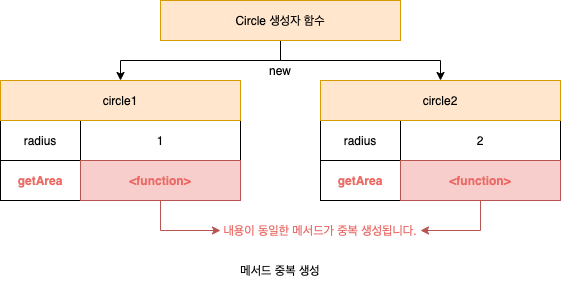
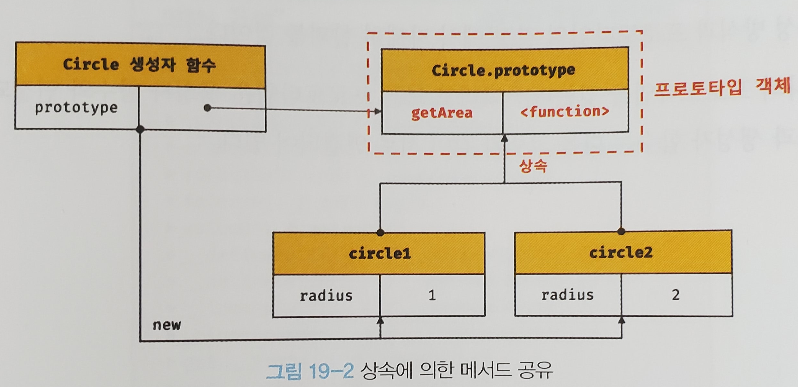
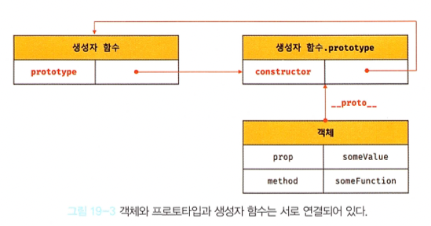
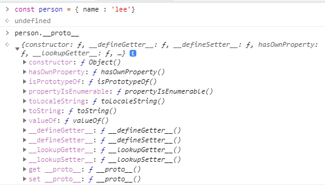
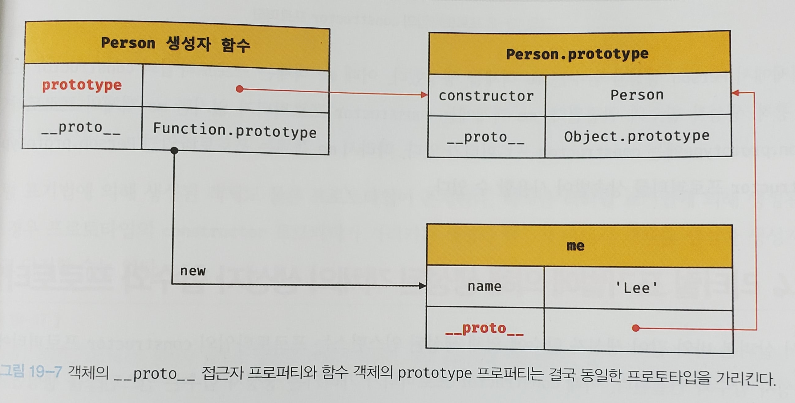

# 19. 프로토타입

자바스크립트는 명령형, 함수형, 프로토타입 기반 객체지향 프로그래밍을 지원하는 멀티 패러다임 프로그래밍 언어다.

간혹 C++나 자바 같은 클래스 기반 객체지향 언어의 특징인 클래스와 상속, 캡슐화를 위한 키워드인 public, private, protected 등이 없어서 자바스크립트는 객체지향 언어가 아니라고 오해하는 경우도 있다. 하지만 자바스크립트는 클래스 기반 객체지향 프로그래밍 언어보다 효율적이며 더 강력한 객체지향 프로그래밍 능력을 지니고 있는 프로토타입 기반의 객체지향 프로그래밍 언어다.

> **클래스**
>
> ES6에서 클래스가 도입되었다. 하지만 ES6의 클래스가 기존의 프로토타입 기반 객체지향 모델을 폐지하고 새로운 객체지향 모델을 제공하는 것은 아니다. 사실 클래스도 함수이며, 기존 프로토타입 기반 패턴의 문법적 설탕이라고 볼 수 있다.
>
> 클래스와 생성자 함수는 모두 프로토타입 기반의 인스턴스를 생성하지만 정확히 동일하게 동작하지는 않는다. 클래서는 생성자 함수보다 엄격하며 클래스는 생성자 함수에서는 제공하지 않는 기능도 제공한다.
>
> 따라서 클래스를 프로토타입 기반 객체 생성 패턴의 단순한 문법적 설탕으로 보기보다는 새로운 객체 생성 메커니즘으로 보는 것이 좀 더 합당하다고 할 수 있다. 클래스에 대해서는 25장 "클래스"에서 자세히 살펴본다.

자바스크립트는 객체 기반의 프로그래밍 언어이며 **자바스크립트를 이루고 있는 거의 "모든 것"이 객체**다. 원시 타입의 값을 제외한 나머지 값들(함수, 배열, 정규 표현식 등)은 모두 객체다. 먼저 객체지향 프로그래밍에 대해 간단히 살펴보자.

## 19.1 객체지향 프로그래밍

객체지향 프로그래밍은 프로그램을 명령어 또는 함수의 목록으로 보는 전통적인 명령형 프로그래밍의 절차지향적 관점에서 벗어나 여러 개의 독립적 단위, 즉 객체의 집합으로 프로그램을 표현하려는 프로그래밍 패러다임을 말한다.

객체지향 프로그래밍은 실세계의 실체(사물이나 개념)를 인식하는 철학적 사고를 프로그래밍에 접목하려는 시도에서 시작한다. 실체는 특징이나 성질을 나타내는 **속성(attribute, property)**을 가지고 있고, 이를 통해 실체를 인식하거나 구별할 수 있다.

예를들어, 사람에게는 다양한 속성이 있으나 우리가 구현하려는 프로그램에서는 사람의 "이름", "주소"라는 속성에만 관심이 있다고 가정하자. 이처럼 다양한 속성 중에서 프로그램에 필요한 속성만 간추려내어 표현하는 것을 **추상화**라 한다.

```javascript
// 이름과 주소 속성을 갖는 객체
const person = {
    name: 'Lee',
    address: 'Seoul'
};

console.log(person); // {name: "Lee", address: "Seoul"}
```

이때 프로그래머는 이름과 주소 속성으로 표현된 객체인 person을 다른 객체와 구별하여 인식할 수 있다. 이처럼 **속성을 통해 여러 개의 값을 하나의 단위로 구성한 복합적인 자료구조**를 객체라 하며, 객체지향 프로그래밍은 독립적인 객체의 집합으로 프로그램을 표현하려는 프로그래밍 패러다임이다.

이번에는 원이라는 개념을 객체로 만들어봐. 원에는 반지름이라는 속성이 있다. 이 반지름을 가지고 원의 지름, 둘레, 넓이를 구할 수 있다. 이때 반지름은 원의 **상태를 나타내는 데이터**이며 원의 지름, 둘레, 넓이를 구하는 것은 **동작**이다. 

```javascript
const circle = {
    radius: 5, // 반지름
    // 원의 지름: 2r
    getDiameter() {
        return 2 * this.radius;
    },
    // 원의 둘레: 2*PI*r
    getPerimeter() {
        return 2 * Math.PI * this.radius;
    },
    // 원의 넓이: PI*r*r
    getArea() {
        return Math.PI * this.radius ** 2;
    }
};

console.log(circle); // {radius: 5. getDiameter: f, getPerimeter: f, getArea: f}

console.log(circle.getDiameter()); // 10
console.log(circle.getPerimeter()); // 31.41592353589793
console.log(circle.getArea()); // 78.53981633974483
```

이처럼 객체지향 프로그래밍은 객체의 **상태**를 나타내는 데이터와 상태 데이터를 조작할 수 있는 **동작**을 하나의 논리적인 단위로 묶어 생각한다. 따라서 객체는 **상태 데이터와 동작을 하나의 논리적인 단위로 묶은 복합적인 자료구조**라고 할 수 있다. 이때 객체의 상태 데이터를 프로퍼티, 동작을 메서드라 부른다.

각 객체는 고유의 기능을 갖는 독립적인 부품으로 볼 수 있지만 자신의 고유한 기능을 수행하면서 다른 객체와 관계성을 가질 수 있다. 다른 객체와 메시지를 주고받거나 데이터를 처리할 수도 있다. 또는 다른 객체의 상태 데이터나 동작을 상속받아 사용하기도 한다.

## 19.2 상속과 프로토타입

상속은 객체지향 프로그래밍의 핵심 개념으로, 어떤 객체의 프로퍼티 또는 메서드를 다른 객체가 상속받아 그대로 사용할 수 있는 것을 말한다. 

자바스크립트는 프로토타입을 기반으로 상속을 구현하여 불필요한 중복을 제거한다. 중복을 제거하는 방법은 기존의 코드를 적극적으로 재사용하는 것이다. 코드 재사용은 개발 비용을 현저히 줄일 수 있는 잠재력이 있으므로 중요하다. 다음 예제를 살펴보자.

```javascript
// 생성자 함수
function Circle(radius) {
    this.radius = radius;
    this.getArea = function () {
        return Math.PI * this.radius ** 2;
    };
}

// 반지름이 1인 인스턴스 생성
const circle1 = new Circle(1);
// 반지름이 2인 인스턴스 생성
const circle2 = new Circle(2);

// Circle 생성자 함수는 인스턴스를 생성할 때마다 동일한 동작을 하는
// getArea 메서드를 중복 생성하고 모든 인스턴스가 중복 소유한다.
// getArea 메서드는 하나만 생성하여 모든 인스턴스가 공유해서 사용하는 것이 바람직하다.
console.log(circle1.getArea === circle2.getArea); // false

console.log(circle1.getArea()); // 3.141592653589793
console.log(circle2.getArea()); // 12.566370614359172
```

17.2절 "생성자 함수"에서 살펴본 바와 같이 생성자 함수는 동일한 프로퍼티(메서드 포함) 구조를 갖는 객체를 여러 개 생성할 때 유용하다. 하지만 위 예제의 생성자 함수는 문제가 있다.

Circle 생성자 함수가 생성하는 모든 객체(인스턴스)는 radius 프로퍼티와 getArea 메서드를 갖는다. radius 프로퍼티 값은 일반적으로 인스턴스마다 다르다. 하지만 getArea 메서드는 모든 인스턴스가 동일한 내용의 메서드를 사용하므로 단 하나만 생성하여 모든 인스턴스가 공요해서 사용하는 것이 바람직하다. 그런데 Circle 생성자 함수는 인스턴스를 생성할 때마다 getArea 메서드를 중복 생성하고 모든 인스턴스가 중복 소유한다.



이처럼 동일한 생성자 함수에 의해 생성된 모든 인스턴스가 동일한 메서드를 중복 소유하는 것은 메모리를 불필요하게 낭비한다. 또한 인스턴스를 생성할 때마다 메서드를 생성하므로 퍼포먼스에도 악영향을 준다. 만약 10개의 인스턴스를 생성하면 내용이 동일한 메서드도 10개 생성된다.상송을 통해 불필요한 중복을 제거해보자. **자바스크립트는 프로토타입을 기반으로 상속을 구현한다.**

```javascript
// 생성자 함수
function Circle(radius) {
    this.radius = radius;
}

// Circle 생성자 함수가 생성한 모든 인스턴스가 getArea 메서드를
// 공유해서 사용할 수 있도록 프로토타입에 추가한다.
// 프로토타입은 Circle 생성자 함수의 prototype 프로퍼티에 바인딩되어 있다.
Circle.prototype.getArea = function () {
    return Math.PI * this.radius * 2;
};

// 인스턴스 생성
const circle1 = new Circle(1);
const circle2 = new Circle(2);

// Circle 생성자 함수가 생성한 모든 인스턴스는 부모 객체의 역할을 하는
// 프로토타입 Circle.prototype으로부터 getArea 메서드를 상속받는다.
// 즉, Circle 생성자 함수가 생성하는 모든 인스턴스는 하나의 getArea 메서드를 공유한다.
console.log(circle1.getArea === circle2.getArea); // true

console.log(circle1.getArea()); // 3.141592653589793
console.log(circle2.getArea()); // 12.566370614359172
```



Circle 생성자 함수가 생성한 모든 인스턴스는 자신의 프로토타입, 즉 상위(부모) 객체 역할을 하는 Circle.prototype의 모든 프로퍼티와 메서드를 상속받는다.

getArea 메서드는 단 하나만 생성되어 프로토타입인 Circle.prototype의 메서드로 할당되어 있다. 따라서 Circle 생성자 함수가 생성하는 모든 인스턴스는 getArea 메서드를 상속받아 사용할 수 있다. 즉, 자신의 상태를 나타내는 radius 프로퍼티만 개별적으로 소유하고 내용이 동일한 메서드는 상속을 통해 공유하여 사용하는 것이다. 

상속은 코드의 재사용이라는 관점에서 매우 유용하다. 생성자 함수가 생성할 모든 인스턴스가 공통적으로 사용할 프로퍼티나 메서드를 프로토타입에 미리 구현해두면 생성자 함수가 생성할 모든 인스턴스는 별도의 구현없이 상위(부모) 객체인 프로토타입의 자산을 공유하여 사용할 수 있다.

## 19.3 프로토타입 객체

프로토타입 객체(또는 줄여서 프로토타입)란 객체지향 프로그래밍의 근간을 이루는 객체 간 상속을 구현하기 위해 사용된다. 프로토타입은 어떤 객체의 상위(부모) 역할을 하는 객체로서 다른 객체에 공유 프로퍼티(메서드 포함)를 제공한다. 프로토타입을 상속받은 하위(자식) 객체는 상위 객체의 프로퍼티를 자신의 프로퍼티처럼 자유롭게 사용할 수 있다.

모든 객체는 [[Prototype]]이라는 내부 슬롯을 가지며, 이 내부 슬롯의 값은 프로토타입의 참조(null인 경우도 있다)다. [[Prototype]]에 저장되는 프로토타입은 객체 생성 방식에 의해 결정된다. 즉, 객체가 생성될 때 객체 생성 방식에 따라 프로토타입이 결정되고 [[Prototype]]에 저장된다.

예를 들어, 객체 리터럴에 의해 생성된 객체의 프로토타입은 Object.prototype이고 생성자 함수에 의해 생성된 프로토타입은 생성자 함수의 prototype 프로퍼티에 바인딩되어 있는 객체다. 이에 대해서는 19.6절 "객체 생성 방식과 프로토타입의 결정"에서 자세히 살펴본다.

모든 객체는 하나의 프로토타입을 갖는다. 그리고 모든 프로토타입은 생성자 함수와 연결되어 있다. 즉, 객체와 프로토타입과 생성자 함수는 다음 그림과 같이 서로 연결되어 있다.




[[Prototype]] 내부 슬롯에는 직접 접근할 수 없지만, 위 그림처럼 _ _ proto _ _ 접근자 프로퍼티를 통해 자신의 프로토타입, 즉 자신의 [[Prototype]] 내부 슬롯이 가리키는 프로토타입에 간접적으로 접근할 수 있다. 그리고 프로토타입은 자신의 constructor 프로퍼티를 통해 생성자 함수에 접근할 수 있고, 생성자 함수는 자신의 prototype 프로퍼티를 통해 프로토타입에 접근할 수 있다.

### 19.3.1 _ _ proto _ _접근자 프로퍼티

**모든 객체는 _ _ proto _ _ 접근자 프로퍼티를 통해 자신의 프로토타입, 즉[[Prototype]] 내부 슬롯에 간접적으로 접근할 수 있다.** 다음 예제를 크롬 브라우저의 콘솔에서 출력해보자.

```javascript
const person = {name: 'Lee'};
```



##### _ _ proto_ _ 는 접근자 프로퍼티다.

16.1절 "내부 슬롯과 내부 메서드"에서 살펴보았듯이 내부 슬롯은 프로퍼티가 아니다. 따라서 자바스크립트는 원칙적으로 내부 슬롯과 내부 메서드에 직접적으로 접근하거나 호출할 수 있는 방법을 제공하지 않는다. 단, 일부 내부 슬롯과 내부 메서드에 한하여 간접적으로 접근할 수 있는 수단을 제공하기는 한다. [[Prototype]] 내부 슬롯에도 직접 접근할 수 없으며 _ _ proto _ _ 접근자 프로퍼티를 통해 간접적으로 [[Prototype]] 내부 슬롯의 값, 즉 프로토 타입에 접근할 수 있다.

16.3.2절 "접근자 프로퍼티"에서 살펴본 것처럼 접근자 프로퍼티는 자체적으로는 값([[Value]] 프로퍼티 어트리뷰트)을 갖지 않고 다른 데이터 프로퍼티의 값을 읽거나 저장할 때 사용하는 접근자 함수, 즉 [[Get]], [[Set]] 프로퍼티 어트리뷰트로 구성된 프로퍼티다.

Object.prototype 접근자 프로퍼티인 _ _ proto _ _는 getter/setter 함수라고 부르는 접근자 함수([[Get]], [[Set]] 프로퍼티 어트리뷰트에 할당된 함수)를 통해 [[Prototype]] 내부 슬롯의 값, 즉 프로토타입을 취득하거나 할당한다. _ _ proto _ _접근자 프로퍼티를 통해 프로토타입에 접근하면 내부적으로 _ _ proto _ _접근자 프로퍼티의 getter 함수인 [[Get]]이 호출된다. _ _ proto _ _ 접근자 프로퍼티를 통해 새로운 프로토타입을 할당하면 _ _ proto _ _접근자 프로퍼티의 setter 함수인 [[Set]]이 호출된다.

```javascript
const obj = {};
const parent = {x: 1};

// getter 함수인 get __proto__가 호출되어 obj 객체의 프로토타입을 취득
obj.__proto__;
// setter 함수인 set __proto__가 호출되어 obj 객체의 프로토타입을 교체
obj.__proto__ = parent;

console.log(obj.x); // 1
```

##### _ _ proto _ _ 접근자 프로퍼티는 상속을 통해 사용된다.

_ _ proto _ _ 접근자 프로퍼티는 객체가 직접 소유하는 프로퍼티가 아니라 Object.prototype의 프로퍼티다. 모든 객체는 상속을 통해 Object.prototype._ _ proto _ _접근자 프로퍼티를 사용할 수 있다.

```javascript
const person = {name: 'Lee'};

// person 객체는 __proto__ 프로퍼티를 소유하지 않는다.
console.log(person.hasOwnProperty('__proto__')); // false

// __proto__ 프로퍼티는 모든 객체의 프로토타입 객체인 Object.prototype의 접근자 프로퍼티다.
console.log(Object.getOwnPropertyDescriptor(Object.prototype,'__proto__'));
// {get: f, set: f, enumerable: false, configurable: true}

// 모든 객체는 Object.prototype의 접근자 프로퍼티 __proto__를 상속받아 사용할 수 있다.
console.log({}.__proto__ === Object.prototype); // true
```

> **Object.prototype**
>
> 모든 객체는 프로토타입의 계층 구조인 프로토타입 체인에 묶여 있다. 자바스크립트 엔진은 객체의 프로퍼티(메서드 포함)에 접근하려고 할 때 해당 객체에 접근하려는 프로퍼티가 없다면 _ _ proto _ _ 접근자 프로퍼티가 가리키는 참조를 따라 자신의 부모 역할을 하는 프로토타입의 프로퍼티를 순차적으로 검색한다. 프로토타입 체인의 종점, 즉 프로토타입 체인의 최상위 객체는 Object.prototype이며, 이 객체의 프로퍼티와 메서드는 모든 객체에 상속된다. 이에 대해서는 19.7절 "프로토타입 체인"에서 자세히 살펴보도록 하자.

##### _ _ proto _ _ 접근자 프로퍼티를 통해 프로토타입에 접근하는 이유

[[Prototype]] 내부 슬롯의 값, 즉 프로토타입에 접근하기 위해 접근자 프로퍼티를 사용하는 이유는 상호 참조에 의해 프로토타입 체인이 생성되는 것을 방지하기 위해서다.

```javascript
const parent = {};
const child = {};

// child 프로토타입을 parent로 설정
child.__proto__ = parent;
// parent 프로토타입을 child로 설정
parent.__proto__ = child; // TypeError: Cyclic __proto__ value
```

위 예제에서는 parent 객체를 child 객체의 프로토타입으로 설정한 후, child 객체를 parent 객체의 프로토타입으로 설정했다. 이러한 코드가 에러 없이 정상적으로 처리되면 서로가 자신의 프로토타입이 되는 비정상적인 프로토타입 체인이 만들어지기 때문에 _ _ proto _ _ 접근자 프로퍼티는 에러를 발생시킨다.

프로토타입 체인은 단방향 링크드 리스트로 구현되어야 한다. 즉, 프로퍼티 검색 방향이 한쪽 방향으로만 흘러가야 한다. 하지만 위 그림과 같이 서로가 자신의 프로토타입이 되는 비정상적인 프로토타입 체인, 다시 말해 순환 참조하는 프로토타입 체인이 만들어지면 프로토타입 체인 종점이 존재하지 않기 때문에 프로토타입 체인에서 프로퍼티를 검색할 때 무한 루프에 빠진다. 따라서 아무런 체크 없이 무조건적으로 프로토타입을 교체할 수 없도록 _ _ proto _ _ 접근자 프로퍼티를 통해 프로토타입에 접근하고 교체하도록 구현되어 있다.

##### _ _ proto _ _ 접근자 프로퍼티를 코드 내에서 직접 사용하는 것은 권장하지 않는다.

_ _ proto _ _ 접근자 프로퍼티는 ES5까지 ECMAScript 사양에 포함되지 않은 비표준이었다. 하지만 일부 브라우저에서 _ _ proto _ _를 지원하고 있었기 때문에 브라우저 호환성을 고려하여 ES6에서 _ _ proto _ _를 표준으로 채택했다. 현재 대부분의 브라우저(IE 11 이상)가 _ _ proto _ _를 지원한다.

하지만 코드 내에서 _ _ proto _ _ 접근자 프로퍼티를 직접 사용하는 것은 권장하지 않는다. 모든 객체가 _ _ proto _ _ 접근자 프로퍼티를 사용할 수 있는 것은 아니기 때문이다. 나중에 살펴보겠지만 직접 상속을 통해 다음과 같이 Object.prototype을 상속받지 않는 객체를 생성할 수도 있기 때문에 _ _ proto _ _접근자 프로퍼티를 사용할 수 없는 경우가 있다.

```javascript
// obj는 프로토타입 체인의 종점이다. 따라서 Object.__proto__를 상속 받을 수 없다.
const obj = Object.create(null);

// obj는 Object.__proto__를 상속받을 수 없다.
console.log(obj.__proto__); // undefined

// 따라서 __proto__보다 Object.getPrototypeOf 메서드를 사용하는 편이 좋다.
console.log(Object.getPrototypeOf(obj)); // null
```

따라서 _ _ proto _ _ 접근자 프로퍼티 대신 프로토타입의 참조를 취득하고 싶은 경우에는 **Object.getPrototypeOf** 메서드를 사용하고, 프로토타입을 교체하고 싶은 경우에는 **Object.setPrototypeOf** 메서드를 사용할 것을 권장한다.

```javascript
const obj = {};
const parent = {x: 1};

// obj 객체의 프로토타입을 취득
Object.getPrototypeOf(obj); // obj.__proto__;
// obj 객체의 프로토타입을 교체
Object.setPrototypeOf(obj, parent); // obj.__proto__ = parent;

console.log(obj.x); // 1
```

Object.getPrototypeOf 메서드와 Object.setPrototypeOf 메서드는 get Object.prototype._ _ proto _ _ 와 set Object.prototype._ _ proto _ _의 처리 내용과 정확히 일치한다. 

### 19.3.2 함수 객체의 prototype 프로퍼티

**함수 객체 만이 소유하는 prototype 프로퍼티는 생성자 함수가 생성할 인스턴스의 프로토타입을 가리킨다.**

```java
// 함수 객체는 prototype 프로퍼티를 소유한다.
(function () {}).hasOwnProperty('prototype'); // -> true

// 일반 객체는 prototype 프로퍼티를 소유하지 않는다.
({}).hasOwnProperty('prototype'); // -> false
```

prototype 프로퍼티는 생성자 함수가 생성할 객체(인스턴스)의 프로토타입을 가리킨다. 따라서 생성자 함수로서 호출할 수 없는 함수, non-constructor인 화살표 함수와 ES6 메서드 축약 표현으로 정의한 메서드는 prototype 프로퍼티를 소유하지 않으면 프로토타입도 생성하지 않는다.

```javascript
// 화살표 함수는 non-constructor다.
const Person = name => {
    this.name = name;
};

// non-constructor는 prototype 프로퍼티를 소유하지 않는다.
console.log(Person.hasOwnProperty('prototype')); // false

// non-constructor는 프로토타입을 생성하지 않는다.
console.log(Person.prototype); // undefined

// ES6의 메서드 축약 표현으로 정의한 메서드는 non-constructor이다.
const obj = {
    foo() {}
};

// non-constructor는 prototype 프로퍼티를 소유하지 않는다.
console.log(obj.foo.hasOwnProperty('prototype')); // false

// non-constructor는 프로토타입을 생성하지 않는다.
console.log(obj.foo.prototype); // undefined
```

생성자 함수로 호출하기 위해 정의하지 않은 일반함수(함수 선언문, 함수 표현식)도 prototype 프로퍼티를 소유하지만 객체를 생성하지 않는 일반 함수의 prototype 프로퍼티는 아무런 의미가 없다.

**모든 객체가 가지고 있는(엄밀히 말하면 Object.prototype으로부터 상속받은) _ _ proto _ _ 접근자 프로퍼티와 함수 객체만이 가지고 있는 prototype 프로퍼티는 결국 동일한 프로토타입을 가리킨다.** 하지만 이들 프로퍼티를 사용하는 주체가 다르다.

|             구분              |    소유     |        값         |  사용 주체  |                          사용 목적                           |
| :---------------------------: | :---------: | :---------------: | :---------: | :----------------------------------------------------------: |
| _ _ proto _ _ 접근자 프로퍼티 |  모든 객체  | 프로토타입의 참조 |  모든 객체  |   객체가 자신의 프로토타입에 접근 또는 교체하기 위해 사용    |
|      prototype 프로퍼티       | constructor | 프로토타입의 참조 | 생성자 함수 | 생성자 함수가 자신이 생성할 객체(인스턴스)의 프로토타입을 할당하기 위해 사용 |

예를 들어, 생성자 함수로 객체를 생성한 후 _ _ proto _ _ 접근자 프로퍼티와 prototype 프로퍼티로 프로토타입 객체에 접근해보자.

```javascript
// 생성자 함수
function Person(name) {
    this.name = name;
}

const me = new Person('Lee');

// 결국 Person.prototype과 me.__proto__는 결국 동일한 프로토타입을 가리킨다.
console.log(Person.prototype === me.__proto__); // true
```



### 19.3.3 프로토타입의 constructor 프로퍼티와 생성자 함수

모든 프로토타입은 constructor 프로퍼티를 갖는다. 이 constructor 프로퍼티는 prototype 프로퍼티로 자신을 참조하고 있는 생성자 함수를 가리킨다. 이 연결은 생성자 함수가 생성될 때, 즉 함수 객체가 생성될 때 이뤄진다. 다음 예제를 살펴보자

```javascript
// 생성자 함수
function Person(name) {
    this.name = name;
}

const me = new Person('Lee');

// me 객체의 생성자 함수는 Person이다.
console.log(me.constructor === Person); // true
```

위 예제에서 Person 생성자 함수는 me 객체를 생성했다. 이때 me 객체는 프로토타입의 constructor 프로퍼티를 통해 생성자 함수와 연결된다. me 객체에는 constructor 프로퍼티가 없지만 me 객체의 프로토타입인 Person.prototype에는 constructor 프로퍼티가 있다. 따라서 me 객체는 프로토타입인 Person.prototype의 constructor 프로퍼티를 상속받아 사용할 수 있다.
